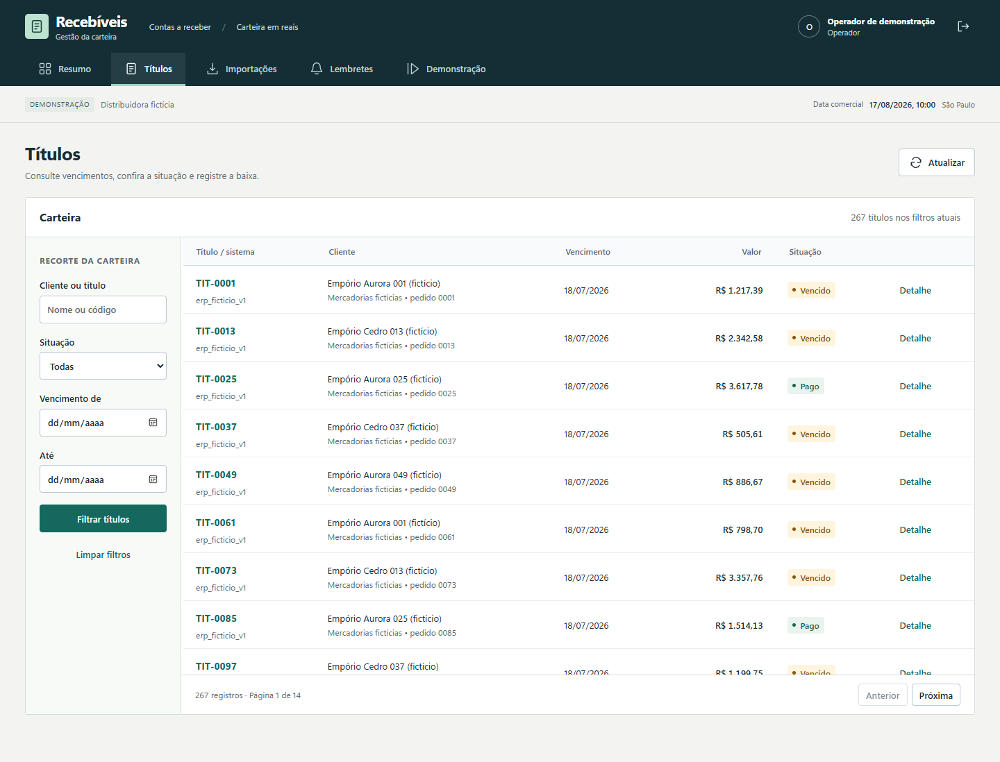
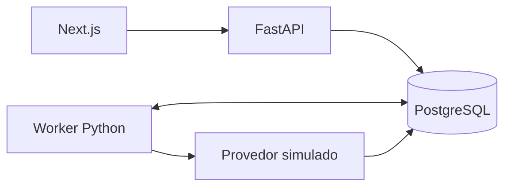

# Gestão de recebíveis

Uma planilha reenviada não pode aumentar a dívida de um cliente. Um pagamento confirmado não deve gerar outra baixa nem autorizar novos lembretes. O Gestão de Recebíveis trata esses problemas com conferência de CSV, transações no banco e acompanhamento das tentativas de envio.

A carteira reúne cliente, vencimento, valor e situação; o detalhe do título mostra o pagamento, o histórico e os lembretes associados. Operadores fazem as alterações e leitores consultam os resultados.



*Captura histórica com dados fictícios. Os filtros consultam toda a carteira; a tabela apresenta uma página por vez. O novo ajuste de composição ainda não tem capturas nem jornadas de navegador validadas; veja o [escopo da revisão de frontend](docs/frontend-quality.md).*

## Problemas que o projeto resolve

| Situação | Como o sistema responde | Exemplo para conferir |
|---|---|---|
| O mesmo lote chega duas vezes, com outro nome ou ordem | Compara a identidade de cada título; não depende do nome do arquivo | Importar `valid.csv` e `reordered.csv` mantém três títulos e R$ 2.000,00 do lote |
| Um arquivo mistura dados novos com uma alteração conflitante | Revalida a prévia e rejeita o lote inteiro sem alterar a carteira parcialmente | `conflicting.csv` tenta mudar `DEMO-001`; `DEMO-004` também não entra |
| O operador repete a baixa depois de perder a resposta | A mesma chave e conteúdo recuperam o pagamento já registrado | Duas chamadas iguais produzem um pagamento; conteúdo diferente retorna conflito |
| O envio foi aceito, mas a resposta não chegou ao worker | Reconcilia a tentativa persistida antes de autorizar outra | O cenário de resposta perdida termina com uma entrega simulada |

O [guia de problema, solução e exemplos](docs/problem-solution.md) liga cada situação à regra e à prova correspondente. As [decisões técnicas](docs/decisoes-tecnicas.md) explicam por que usar centavos, transações, fila no PostgreSQL e tentativas separadas das entregas, com os respectivos limites.

## Um percurso para conferir o resultado

1. Entre como operador e abra **Importações**. Envie [`valid.csv`](data/samples/valid.csv): a prévia apresenta três títulos novos e R$ 2.000,00. Confira as linhas e confirme.
2. Reenvie [`repeated.csv`](data/samples/repeated.csv). Os títulos aparecem como existentes; a confirmação preserva a quantidade e o saldo.
3. Em **Títulos**, procure `DEMO-001` e abra o detalhe. Registre o pagamento integral e confira a baixa na linha do tempo. Uma repetição da mesma operação não cria outro pagamento.
4. Em **Lembretes**, selecione **Ver tentativas** para consultar o resultado de cada envio sem perder a busca ou a página da fila.

O [roteiro de demonstração](docs/demo.md) inclui uma falha transitória, recuperação do envio e conflito de importação. Os lembretes usam um provedor simulado persistente: uma entrega registrada na página não representa uma mensagem enviada a um cliente.

## Ler a carteira

| Área | O que conferir |
|---|---|
| [Resumo](docs/img/resumo.png) | Saldo aberto e vencimentos, separados dos pagamentos recebidos no período |
| Títulos | Busca por cliente/código, vencimento, situação, pagamento e cancelamento |
| Importações | Arquivo → conferência das linhas → confirmação, com conflitos identificados |
| Lembretes | Etapa, tentativas, próxima execução e detalhe da entrega simulada |
| Demonstração | Data comercial, pausa do processamento e cenários de falha |

O perfil **leitor** consulta as mesmas informações, sem importar, pagar, cancelar ou controlar a demonstração.

## Rodar localmente

Use Docker Desktop com containers Linux e PowerShell 7. Python, Node e PostgreSQL executam nos containers.

Na raiz do projeto:

```powershell
.\scripts\gestao-recebiveis.ps1 setup
```

O setup gera a configuração local, constrói as imagens e carrega os dados fictícios. A interface fica em `http://localhost:3101`; a documentação da API, em `http://localhost:8101/docs`. As contas de demonstração aparecem no login.

Se você já executou a versão com PostgreSQL Debian, siga a [migração do banco](docs/verification.md#banco-de-versões-anteriores) antes de iniciar esta versão Alpine.

Sem PowerShell, copie `.env.example` para `.env`, troque `SESSION_SECRET`, `DATABASE_PASSWORD`, `DATABASE_OWNER_PASSWORD` e `DATABASE_APP_PASSWORD` por valores aleatórios independentes e rode o que o script faz:

```sh
docker compose build db
docker compose build api
docker compose build frontend
docker compose up -d --wait db
docker compose run --rm migrate
docker compose run --rm --no-deps seed
docker compose up -d --wait --wait-timeout 180 db api worker frontend
```

## Como verificar

```powershell
.\scripts\gestao-recebiveis.ps1 test
.\scripts\gestao-recebiveis.ps1 proof
```

`test` executa as verificações de backend e frontend e percorre a interface no navegador, usando bancos descartáveis. `proof` interrompe o processamento depois de uma aceitação, reinicia seu PostgreSQL de teste e verifica a recuperação da mesma tentativa, sem duplicar a entrega simulada.

A [prova de restauração em outro volume](docs/restore-proof.md) acrescenta um caso controlado: R$ 125 em títulos, R$ 50 pagos e R$ 75 abertos, com a mesma baixa e entrega simulada após recuperar o banco. Inclui capturas reais, recusas de backup corrompido/destino ocupado, hashes e tempos locais. Ela usa uma fixture própria de dois títulos, separada dos exemplos de R$ 2.000 acima.

Os [resultados e o escopo das revisões](docs/verification.md) distinguem a validação da interface das provas de concorrência, permissões, migração e recuperação. Os comandos completos de automação estão no [workflow de CI](.github/workflows/ci.yml).

## Como funciona



Valores são armazenados em centavos. A confirmação do CSV revalida os dados no banco; transações e chaves idempotentes impedem a repetição de efeitos financeiros. A fila usa PostgreSQL com `SKIP LOCKED`, lease e heartbeat. O provedor simulado persiste a aceitação antes de reproduzir uma resposta perdida, permitindo verificar a recuperação após reinício.

O login reserva cotas atômicas antes de conferir senhas. API e worker usam credenciais distintas da administração e das migrações. Consulte as [decisões técnicas](docs/decisoes-tecnicas.md) e o [procedimento de atualização preservando dados](docs/security.md).

## Limites

O escopo é uma empresa, BRL e pagamento integral. Envio externo, Pix, boleto, juros e estorno não estão implementados. O [plano de integração com provedor real](docs/provider-integration-plan.md) define o contrato e os ensaios ainda pendentes de idempotência e reconciliação. A demonstração não foi avaliada com usuários reais.

Os serviços são publicados em loopback. Uma implantação para múltiplos usuários precisa de uma borda que identifique clientes com confiança, conforme a [documentação de segurança](docs/security.md).

Python 3.13, FastAPI, SQLAlchemy, PostgreSQL 18, Next.js 16, TypeScript e Docker. Licença MIT.
