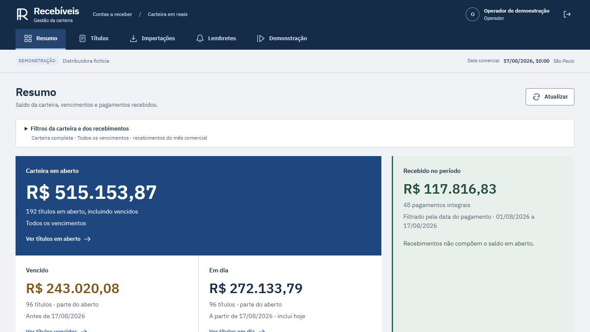
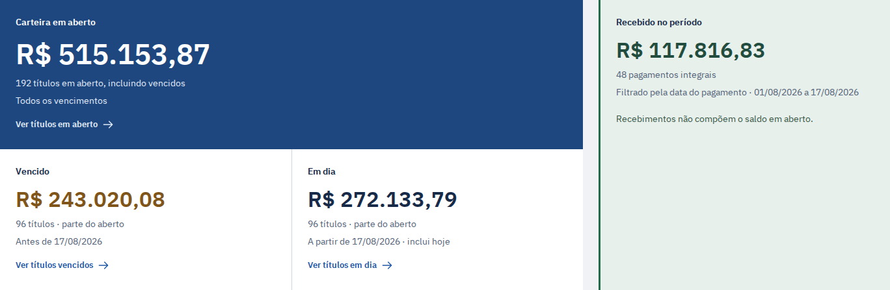

# Gestão de recebíveis

Desenvolvi uma aplicação de demonstração para quem confere contas a receber. Um **título** registra o valor que um cliente deve e seu vencimento; dar **baixa** é registrar o pagamento integral dessa obrigação. O operador importa títulos por CSV, confere conflitos, registra pagamentos e acompanha lembretes simulados. O perfil leitor consulta a mesma carteira sem alterá-la. Os dados representam uma empresa fictícia, em reais (BRL).



*Página principal da demonstração.*

[Na prática](#na-prática) · [Implementação](#implementação) · [Executar e verificar](#executar-e-verificar) · [Limites e manutenção](#limites-e-manutenção)

<p></p>

## Na prática



*Recorte real dos indicadores, capturado localmente em 22/09/2026, sobre `deade1369`: 192 títulos fictícios em aberto e 48 pagamentos no período. Esta massa é distinta do caso de R$ 125 abaixo. [Telas atuais, reprodução e arquivo histórico](docs/image-captures.md).*

### Prova histórica: a mesma baixa após restauração

O problema aparece quando um arquivo chega novamente ou a conexão cai depois de uma baixa. Repetir a entrada não pode criar outra dívida ou outro pagamento. Na prova documentada, dois títulos de **R$ 50 + R$ 75 = R$ 125** continuaram sendo os mesmos após reimportação e restauração; repetir a baixa de R$ 50 devolveu o pagamento já registrado e manteve **R$ 75 em aberto**.

[Captura histórica completa: Título fictício RESTORE-PAID com pagamento integral de R$ 50 e registro na linha do tempo](docs/screenshots/restore-proof/11adf9df35ba4314945ffdd4fbaeabfc/04-mesma-baixa-preservada.png)

*Captura histórica real da execução `11adf9df…`, de 22/09/2026. Confira o valor pago e o evento na linha do tempo; a igualdade do pagamento foi verificada no banco, não deduzida da imagem. [Imagem completa](docs/screenshots/restore-proof/11adf9df35ba4314945ffdd4fbaeabfc/04-mesma-baixa-preservada.png) · [cenário, fontes e limites](docs/restore-proof.md). A composição atual da interface aparece na primeira imagem.*

### Como trato as repetições

- **Mesmo título, outro arquivo:** a identidade é sistema de origem + código externo. Reordenar ou renomear o CSV não cria uma obrigação nova.
- **Linha nova junto de um conflito:** a confirmação rejeita o lote inteiro. Nenhuma linha válida fica gravada pela metade.
- **Mesma baixa após perder a resposta:** a chave e o conteúdo recuperam o pagamento já confirmado. Conteúdo diferente com a mesma chave retorna conflito.
- **Mensagem aceita com resposta perdida:** mantenho a tentativa desconhecida até reconciliá-la. Entrega simulada e tentativa são registros distintos.

O [guia de casos](docs/problem-solution.md) liga esses problemas às entradas, ao código e aos testes. As capturas de importação, conflito e reconciliação ficam junto de seus casos, com a versão identificada. Lembretes usam exclusivamente um provedor fictício persistente; nenhuma mensagem é enviada a cliente real.

<p></p>

## Implementação

### O que eu implementei

- O parser de CSV, a prévia por linha e a confirmação transacional, com identidade composta, comparação dos registros e rejeição sem efeito parcial ([importação](backend/src/gestao_recebiveis/imports.py), [parser](backend/src/gestao_recebiveis/import_csv.py)).
- A baixa integral, a idempotência — repetir uma operação sem repetir seu efeito — e a auditoria financeira, coordenadas com o cancelamento de pendências ([pagamento](backend/src/gestao_recebiveis/receivables.py)).
- A fila de lembretes com prazo de posse, renovação, token que invalida o worker antigo e reconciliação de resultado incerto ([serviço](backend/src/gestao_recebiveis/reminders/service.py), [simulador](backend/src/gestao_recebiveis/reminders/provider.py)).
- Os papéis operador/leitor, as sessões, a proteção de mutações e a reserva persistente de capacidade antes de verificar a senha ([autenticação](backend/src/gestao_recebiveis/auth.py), [admissão](backend/src/gestao_recebiveis/login_admission.py)).
- A carteira, os fluxos de conferência e os testes de concorrência, repetição e recuperação; também configurei os ambientes descartáveis e a prova de restauração ([interface](frontend/src/features/workspace.tsx), [testes](backend/tests), [prova](scripts/prove_restore.py)).

FastAPI atende HTTP; SQLAlchemy/psycopg acessam PostgreSQL; Next.js/React apresentam a carteira. As [decisões técnicas](docs/decisoes-tecnicas.md) explicam como integrei essas ferramentas, os efeitos e os compromissos da implementação.

### Stack

<p>
  
  
  
  
  
  
  
</p>

Python e FastAPI na API e no worker; PostgreSQL na carteira e na fila; TypeScript, React e Next.js na interface. A demonstração roda com Docker Compose.

<p></p>

## Executar e verificar

### Rodar localmente

Use Docker Desktop com containers Linux e PowerShell 7. Python, Node e PostgreSQL executam nos containers.

Na raiz do projeto:

```powershell
.\scripts\gestao-recebiveis.ps1 setup
```

O setup gera a configuração local, constrói as imagens e carrega os dados fictícios. A interface fica em `http://localhost:3101`; a documentação da API, em `http://localhost:8101/docs`. As contas de demonstração aparecem no login.

Se você já executou a versão com PostgreSQL Debian, siga a [migração do banco](docs/verification.md#banco-de-versões-anteriores) antes de iniciar esta versão Alpine.

Sem PowerShell, copie `.env.example` para `.env`, troque `SESSION_SECRET`, `DATABASE_PASSWORD`, `DATABASE_OWNER_PASSWORD` e `DATABASE_APP_PASSWORD` por valores aleatórios independentes e rode o que o script faz:

```sh
docker compose build db
docker compose build api
docker compose build frontend
docker compose up -d --wait db
docker compose run --rm migrate
docker compose run --rm --no-deps seed
docker compose up -d --wait --wait-timeout 180 db api worker frontend
```

### Reproduzir um lote pequeno

Na demonstração iniciada, importe [valid.csv](data/samples/valid.csv): `1250.09 + 480.10 + 269.81 = 2000.00`, três títulos. Confirme, reenvie [reordered.csv](data/samples/reordered.csv) e confira que quantidade e saldo do lote não aumentaram. Depois envie [conflicting.csv](data/samples/conflicting.csv): ele tenta mudar `DEMO-001` e incluir `DEMO-004`; o lote inteiro deve ser rejeitado.

Essa fixture de R$ 2.000 é independente dos dois títulos de R$ 125 da imagem. O [roteiro](docs/demo.md) descreve baixa e tentativas simuladas; o [contrato HTTP](docs/api-contract.md) permite conferir a resposta exata. No Resumo, vencido e em dia compõem o aberto; recebido usa seu próprio período de pagamento.

### Verificação e situação atual

```powershell
.\scripts\gestao-recebiveis.ps1 test
.\scripts\gestao-recebiveis.ps1 proof
```

`test` reúne verificações de código, backend e navegador em bancos descartáveis. `proof` também interrompe o processamento e reinicia um PostgreSQL de teste para verificar a mesma tentativa. Nesta auditoria foram executadas as etapas isoladas de build, backend, atualização do banco, checks frontend e navegador; o ensaio completo `proof` não foi repetido.

O candidato local baseado em `4bb9b57` passou em **158 testes com PostgreSQL**, **16 testes das guardas de restauração**, Ruff, formato e mypy; instalação frontend pelo lock, lint, tipos e build também passaram. Os **15 casos Playwright: 14 jornadas interativas e 1 caso de formatação BRL** passaram sem skip ou retry. Os [resultados, ambiente e limites](docs/verification.md) registram a falha inicial de formato no Windows, a correção e a repetição dos checks; preservam também o [CI histórico de `5718cdad`](https://github.com/arthurjoanes/gestao-recebiveis/actions/runs/35744528178). O [CI de `7907680`](https://github.com/arthurjoanes/gestao-recebiveis/actions/runs/35757413426) também aprovou essas correções após a publicação.

A [restauração em volume novo](docs/restore-proof.md) é uma prova histórica adicional de conteúdo, sequências, pagamento e tentativa preservados. Não confundo dump gerado com restauração validada. Fontes e tentativas com falha permanecem rastreáveis nos seus manifestos.

<p></p>

## Limites e manutenção

### Decisões e limites

Escolhi centavos inteiros para as operações em BRL; deixei a autorização e a confirmação no servidor; mantive a fila no mesmo banco para coordenar título, baixa e lembrete. Isso reduz serviços da demonstração e permite transações compartilhadas, mas concentra a operação no PostgreSQL e exige representar a incerteza de um envio. [Arquitetura e fronteiras](docs/architecture.md) · [alternativas e compromissos](docs/decisoes-tecnicas.md).

O escopo é uma empresa e pagamento integral. Pix, boleto, juros, estorno e envio externo não estão implementados. Uma baixa impede autorizações futuras; não desfaz uma autorização anterior em trânsito. O [plano de provedor real](docs/provider-integration-plan.md) descreve ensaios ainda necessários. Não medi produtividade com usuários, tolerância à perda do host ou capacidade de produção.

O setup publica serviços somente em loopback. Uso por múltiplos clientes exige uma borda que identifique origens com confiança e configuração de segurança apropriada: [limites e atualização](docs/security.md). Comparação visual pareada com o baseline, zoom nativo, leitor de tela, conformidade AA integral e desempenho percebido continuam sem comprovação; o [escopo da revisão visual](docs/frontend-quality.md) separa essas verificações das jornadas automatizadas.

Para manutenção, comece pelos [contratos HTTP](docs/api-contract.md) e [de dados](docs/data-contract.md), localize a regra nos arquivos ligados acima e rode os testes antes de mudar seu comportamento. Em falha de inicialização, confira `docker compose ps` e `docker compose logs --tail 100 api worker`; o [guia de verificação](docs/verification.md) cobre banco antigo e ambientes de teste. Problemas reproduzíveis podem ser relatados nas [issues do projeto](https://github.com/arthurjoanes/gestao-recebiveis/issues), sem credenciais ou dados reais.

Código sob MIT. A fonte IBM Plex Sans mantém sua [licença OFL 1.1](frontend/src/app/fonts/plex-LICENSE.txt) e [origem](frontend/src/app/fonts/sources.json).

Ícones da stack: [Devicon — licença MIT](docs/stack/LICENSE.devicon).
