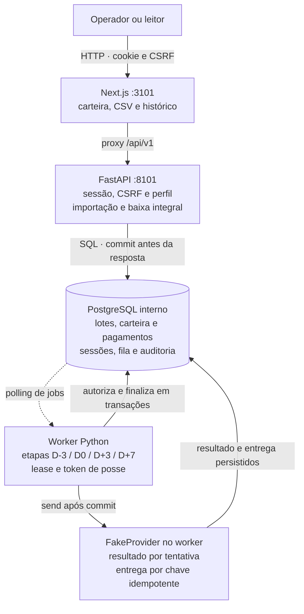

# Gestão de recebíveis

Aplicação de demonstração para importar contas a receber, registrar pagamentos integrais e acompanhar lembretes simulados. Desenvolvi a carteira, as regras financeiras e os fluxos de recuperação com dados de uma empresa fictícia em reais (BRL).

<!-- Navegação do README -->
<p>
  <a href="#demonstração"></a>
  <a href="#arquitetura"></a>
  <a href="#executar-localmente"></a>
  <a href="#verificação-e-evidências"></a>
  <a href="https://www.linkedin.com/in/arthur-joanes-6a2967373/"></a>
</p>

## Visão geral

Um **título** registra quanto um cliente deve e o vencimento; dar **baixa** é registrar o pagamento integral. O operador altera a carteira e o leitor apenas consulta. O problema central é preservar a mesma dívida e o mesmo pagamento quando um arquivo ou uma requisição se repete.

| Situação                           | Comportamento implementado                                 |
| ---------------------------------- | ---------------------------------------------------------- |
| CSV renomeado ou reordenado        | Identifica o título por sistema de origem + código externo |
| Linha nova junto de um conflito    | Rejeita a confirmação inteira, conservando o diagnóstico   |
| Mesma baixa após perder a resposta | Recupera o pagamento para a mesma chave e conteúdo         |
| Envio aceito com resposta perdida  | Reconcilia a tentativa antes de autorizar outra etapa      |

O [guia de casos e testes](docs/problem-solution.md) liga esses comportamentos à [importação](backend/src/gestao_recebiveis/imports.py), ao [pagamento](backend/src/gestao_recebiveis/receivables.py) e aos [lembretes](backend/src/gestao_recebiveis/reminders/service.py).

<a id="na-prática"></a>
<a id="como-trato-as-repetições"></a>

## Demonstração


_Página principal já versionada. Os [recortes com data, versão e hashes](docs/image-captures.md) permitem conferir estados específicos sem imagens de página inteira._

<a id="reproduzir-um-lote-pequeno"></a>

Na demo iniciada, importe [valid.csv](data/samples/valid.csv): **R$ 1.250,09 + R$ 480,10 + R$ 269,81 = R$ 2.000,00**, três títulos. Reenvie [reordered.csv](data/samples/reordered.csv): quantidade e saldo do lote devem permanecer iguais. [conflicting.csv](data/samples/conflicting.csv) tenta mudar `DEMO-001` e incluir `DEMO-004`; a confirmação deve rejeitar o lote inteiro. [Roteiro completo](docs/demo.md).

<a id="prova-histórica-a-mesma-baixa-após-restauração"></a>

A prova histórica de **22/09/2026** usa outra massa: dois títulos de **R$ 50 + R$ 75 = R$ 125**. Após restauração, repetir a baixa de R$ 50 conservou o pagamento e **R$ 75 em aberto**, conforme o [manifesto da execução `11adf9df…`](docs/evidence/restore-proof/11adf9df35ba4314945ffdd4fbaeabfc/manifest.json). Veja o [cenário, as imagens e os limites](docs/restore-proof.md).

## Arquitetura



O caminho HTTP é síncrono; a seta pontilhada representa o consumo em segundo plano por polling, sem chamada da API para o worker. API e worker compartilham o pacote Python; os módulos internos estão abertos no guia detalhado. O simulador roda no worker e usa o mesmo PostgreSQL; não existe serviço externo de e-mail nesta implementação.

| Caminho | Responsabilidade e garantia |
| --- | --- |
| [CSV → prévia → confirmação](backend/src/gestao_recebiveis/imports.py) | Guarda bytes e diagnóstico; relê o lote e usa savepoint para rejeitar conflitos sem importação parcial |
| [Baixa integral](backend/src/gestao_recebiveis/receivables.py) | Serializa a chave idempotente, bloqueia o título e grava pagamento, cancelamento de pendências e auditoria na mesma transação |
| [Lembrete em segundo plano](backend/src/gestao_recebiveis/worker.py) | Assume o job por lease, autoriza antes de enviar e reconcilia a mesma tentativa quando o resultado é desconhecido |
| [Persistência e acesso](backend/src/gestao_recebiveis/models.py) | Unicidade no banco protege título, pagamento e etapa; o runtime usa `gestao_app`, separado do papel de migração |

O [Compose](compose.yaml) publica frontend/API apenas em loopback e mantém o banco interno. `db-init` provisiona papéis, `migrate` aplica o schema e `seed` carrega a demo como tarefas pontuais. O [guia de arquitetura](docs/architecture.md) detalha módulos, tabelas, sequência de recuperação e limites das transações.

<a id="implementação"></a>
<a id="o-que-eu-implementei"></a>
<a id="stack"></a>

## Stack e decisões

<p>
  
  
  
  
  
  
  
</p>

| Camada       | Escolha e compromisso                                                                             |
| ------------ | ------------------------------------------------------------------------------------------------- |
| Interface    | Next.js, React e TypeScript apresentam a carteira; regras financeiras permanecem no servidor      |
| API e worker | Python/FastAPI e SQLAlchemy/psycopg; transações e tratamento explícito de conflitos               |
| Persistência | PostgreSQL para carteira e fila; permite coordenação transacional e concentra a operação no banco |
| Execução     | Docker Compose, com bancos separados para demo e testes                                           |

Escolhi centavos inteiros para BRL, pagamentos integrais e uma fila no mesmo banco. Essas escolhas estão ligadas ao problema e aos respectivos custos nas [decisões técnicas](docs/decisoes-tecnicas.md). Dependências e versões: [lock Python](backend/uv.lock), [lock frontend](frontend/package-lock.json) e [Dockerfile do banco](database/Dockerfile).

<a id="executar-e-verificar"></a>
<a id="rodar-localmente"></a>

## Executar localmente

Use Docker Desktop com containers Linux e PowerShell 7. Na raiz:

```powershell
.\scripts\gestao-recebiveis.ps1 setup
```

O [script de setup](scripts/gestao-recebiveis.ps1) cria a configuração local, constrói as imagens do [Compose](compose.yaml) e carrega os dados fictícios. Abra a [interface](http://localhost:3101) ou a [documentação da API](http://localhost:8101/docs). As contas demo aparecem no login.

Se já usou a versão PostgreSQL Debian, leia a [migração do banco](docs/verification.md#banco-de-versões-anteriores). A [execução sem PowerShell](docs/demo.md#executar-sem-powershell) apresenta os mesmos passos do Compose. Para diagnóstico, confira `docker compose ps` e `docker compose logs --tail 100 api worker`.

<a id="verificação-e-situação-atual"></a>

## Verificação e evidências

```powershell
.\scripts\gestao-recebiveis.ps1 test
.\scripts\gestao-recebiveis.ps1 proof
```

No [script principal](scripts/gestao-recebiveis.ps1), `test` verifica backend e navegador em ambientes descartáveis, incluindo o [Compose E2E](compose.e2e.yaml). `proof` executa a [prova de interrupção e reinício](scripts/prove.ps1) do banco de teste; a restauração em volume novo tem [executor separado](scripts/prove_restore.py).

O [recibo do CI de 22/09/2026](docs/evidence/frontend-ci-20260922.json), sobre `5718cdad`, registra **15 casos Playwright**; o [recibo da revisão local](docs/evidence/portfolio-review-20260922.json) registra **158 testes backend** na versão que identifica. A [verificação](docs/verification.md) separa essa execução das revisões locais e dos resultados posteriores. Contagens e capturas são históricas; editar a documentação não reexecuta as suítes.

<a id="limites-e-manutenção"></a>
<a id="decisões-e-limites"></a>

## Limites e segurança

- O [contrato financeiro](backend/src/gestao_recebiveis/schemas.py) cobre uma empresa, BRL e pagamento integral; Pix, boleto, juros, estorno e envio externo não estão implementados.
- Baixa confirmada impede novas [autorizações de lembrete](backend/src/gestao_recebiveis/reminders/service.py); não desfaz uma autorização anterior em trânsito.
- O provedor simulado usa o mesmo PostgreSQL. A restauração local não prova recuperação de um efeito em serviço externo ou perda do host.
- O Compose publica serviços em loopback. Uso público exige identidade, HTTPS e configuração operacional próprios.
- Produtividade com usuários, carga de produção, leitor de tela, zoom nativo e conformidade AA integral não foram demonstrados.

Os guias de [segurança](docs/security.md) e [qualidade da interface](docs/frontend-quality.md) detalham o alcance das verificações. O [plano de provedor real](docs/provider-integration-plan.md) é trabalho proposto.

## Documentação

| Para entender ou fazer                 | Guia                                                                                              |
| -------------------------------------- | ------------------------------------------------------------------------------------------------- |
| Seguir um caso do problema até o teste | [Problema e solução](docs/problem-solution.md)                                                    |
| Conferir contratos                     | [HTTP](docs/api-contract.md) · [CSV e dados](docs/data-contract.md)                               |
| Entender componentes e escolhas        | [Arquitetura](docs/architecture.md) · [Decisões](docs/decisoes-tecnicas.md)                       |
| Reproduzir e recuperar                 | [Demo](docs/demo.md) · [Verificação](docs/verification.md) · [Restauração](docs/restore-proof.md) |
| Conferir afirmações e datas            | [Fontes e afirmações](docs/fontes-e-afirmacoes.md)                                                |
| Manter a apresentação                  | [Capturas](docs/image-captures.md) · [Padrão documental](docs/padrao-documentacao.md)             |

Relate problemas nas [issues](https://github.com/arthurjoanes/gestao-recebiveis/issues), com passos e versão, sem credenciais ou dados reais.

## Autor e licença

Desenvolvido por **Arthur Joanes**. Para conversar sobre recebíveis, consistência e recuperação:

<p>
  <a href="https://www.linkedin.com/in/arthur-joanes-6a2967373/">
    
    <strong>Arthur Joanes no LinkedIn</strong>
  </a>
</p>

Código sob [licença MIT](LICENSE). IBM Plex Sans mantém a [licença OFL 1.1](frontend/src/app/fonts/plex-LICENSE.txt) e a [origem](frontend/src/app/fonts/sources.json). Ícones da stack e LinkedIn: [Devicon, licença MIT](docs/stack/LICENSE.devicon).
