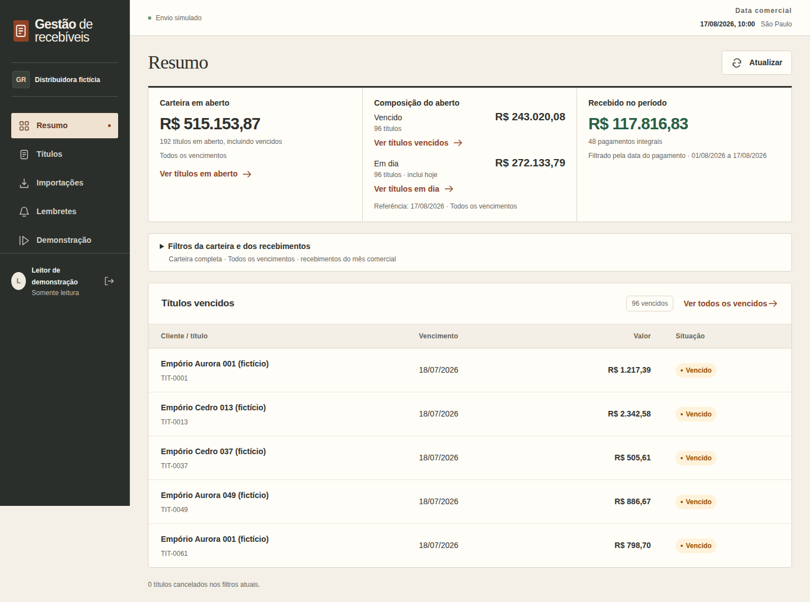

# Gestão de recebíveis

Criei uma aplicação de contas a receber com importação CSV, pagamentos integrais e lembretes simulados. Usei dados fictícios para estudar repetição de requisições e recuperação de falhas.



Reenviar um CSV não pode aumentar a dívida, e repetir uma baixa não pode duplicar o pagamento. Tratei esses casos no backend e registrei as tentativas de lembretes para recuperar resultados incertos.

## Como organizei

A interface envia as operações à API. O PostgreSQL guarda a carteira e a fila; um worker processa os lembretes usando um provedor fictício persistente.


## Escolhas que fiz

- Guardei dinheiro em centavos e enviei strings no JSON para conservar precisão. Em troca, precisei converter os valores explicitamente na interface.
- Revalidei o CSV na confirmação e usei transações e chaves idempotentes nas baixas. Isso exige cuidado com locks, mas permite repetir operações sem duplicar efeitos.
- Mantive a fila no PostgreSQL, com `SKIP LOCKED`, lease e heartbeat. Dispensei um broker separado e aceitei concentrar a coordenação no banco.
- Persisti a aceitação do provedor antes de simular uma resposta perdida. Consigo testar a recuperação após reinício, mas isso não garante entrega por um serviço externo.

As [decisões técnicas](docs/decisoes-tecnicas.md) e o roteiro da [demo](docs/demo.md) estão em `docs/`.

## Rodar localmente

Use Docker Desktop com containers Linux e PowerShell 7. Python, Node e PostgreSQL executam nos containers.

Na raiz do projeto:

```powershell
.\scripts\gestao-recebiveis.ps1 setup
```

O setup gera a configuração local, constrói as imagens e carrega os dados fictícios. A interface fica em `http://localhost:3101`; a documentação da API, em `http://localhost:8101/docs`. As contas de demonstração aparecem no login.

Sem PowerShell, copie `.env.example` para `.env`, troque `SESSION_SECRET` e `DATABASE_PASSWORD` por valores aleatórios e rode o que o script faz:

```sh
docker compose build api
docker compose build frontend
docker compose up -d --wait db
docker compose run --rm --no-deps migrate
docker compose run --rm --no-deps seed
docker compose up -d --wait --wait-timeout 180 db api worker frontend
```

## Verificação

```powershell
.\scripts\gestao-recebiveis.ps1 test
.\scripts\gestao-recebiveis.ps1 proof
```

Passaram 145 testes de backend e 12 testes Playwright, além de lint, formatação e tipos. Cobri importação, concorrência, permissões, pagamentos e navegação.

O `proof` é o teste de reinício do banco: interrompe o processamento após uma aceitação, reinicia seu banco descartável e verifica a recuperação sem duplicar a entrega simulada. Só existe em PowerShell (`scripts/prove.ps1`).

Os mesmos testes, com os comandos do CI (`.github/workflows/ci.yml`):

```sh
docker compose --profile test build api
docker compose --profile test build frontend
docker compose --profile test build frontend-checks
docker compose --profile test build e2e
docker compose run --rm test
docker compose run --rm --no-deps frontend-checks
docker compose -f compose.yaml -f compose.e2e.yaml -p pf-gestao-recebiveis-e2e up -d --wait db
docker compose -f compose.yaml -f compose.e2e.yaml -p pf-gestao-recebiveis-e2e run --rm --no-deps migrate
docker compose -f compose.yaml -f compose.e2e.yaml -p pf-gestao-recebiveis-e2e run --rm --no-deps seed
docker compose -f compose.yaml -f compose.e2e.yaml -p pf-gestao-recebiveis-e2e up -d --wait --wait-timeout 180 api worker frontend
docker compose -f compose.yaml -f compose.e2e.yaml -p pf-gestao-recebiveis-e2e run --rm --no-deps e2e
docker compose -f compose.yaml -f compose.e2e.yaml -p pf-gestao-recebiveis-e2e --profile test --profile tools down --remove-orphans
docker compose stop db-test
```

## Limites

Deixei o escopo em uma empresa, BRL e pagamento integral. Não implementei envio externo, Pix, boleto, juros ou estorno. Antes de integrar um provedor real, validaria seu contrato de idempotência e reconciliação. Ainda não avaliei o sistema com usuários reais.


Python 3.13, FastAPI, SQLAlchemy, PostgreSQL 18, Next.js 16, TypeScript e Docker. Licença MIT.
