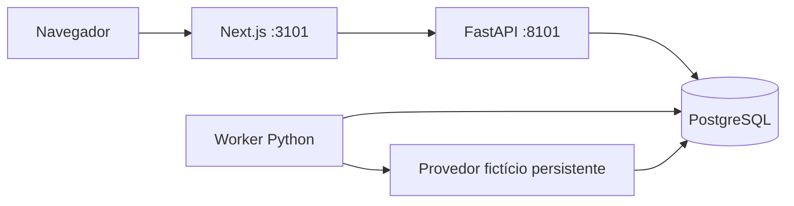

# Arquitetura da gestão de recebíveis

## Problema, usuários e limites

Importação de títulos, recebimentos e lembretes simulados. Operadores importam, pagam, cancelam e controlam a demo; leitores consultam. Uma empresa, BRL, pagamento integral.

## Componentes

API e worker compartilham o pacote Python. SQLAlchemy síncrono, psycopg e transações explícitas. Os jobs ficam no PostgreSQL para usar os mesmos locks e transações das regras financeiras, sem outro serviço.

## Dados e transações

Cliente único por source_system/external_customer_id; título por source_system/external_receivable_id. IDs internos em INTEGER positivo; valores em BIGINT de centavos. Estado open/paid/canceled persistido; overdue calculado. Pagamento único por título, chave idempotente e conteúdo conferidos. Lotes guardam bytes originais, SHA-256, linhas e relatórios.
Importação: lote bloqueado; savepoint para clientes/títulos/auditoria; erro desfaz todos os efeitos financeiros, preservando diagnóstico. Clientes e títulos são processados em ordem de chave com ON CONFLICT DO NOTHING seguido de comparação bloqueada.
Pagamento/cancelamento: lock título antes de jobs, alteração financeira, cancelamento de pendências e auditoria na mesma transação. Pagamento também serializa a chave idempotente com advisory lock; reutilizar a chave para outro título ou conteúdo resulta em conflito. Os locks decisivos atualizam a instância SQLAlchemy com `populate_existing`, evitando decisões sobre um objeto cacheado antes de uma mudança concorrente.

Na API, `get_session` abre a transação e a dependência FastAPI usa escopo `function`: o commit termina antes de enviar a resposta ao cliente. Casos de uso não fazem commit. O worker e os comandos de seed abrem suas próprias transações, usando os mesmos casos de uso.

## Contratos HTTP

Rotas sob `/api/v1` recebem entradas Pydantic e declaram modelos de resposta em `responses.py`. Centavos atravessam JSON como strings de inteiros não negativos; timestamps exigem fuso, estados são explícitos e listas seguem paginação tipada. Serializadores selecionam os campos públicos; senhas e conteúdo bruto dos lotes não fazem parte das respostas. O [contrato HTTP](api-contract.md) resume os recursos e o Swagger local expõe o OpenAPI.

O upload aceita CSV UTF-8 até 2 MiB e 5.000 registros. Um middleware limita o corpo antes do parser, inclusive sem `Content-Length`: upload com 64 KiB adicionais de envelope, demais mutações com 8 KiB. A confirmação sempre relê o conteúdo persistido e revalida o estado do banco. A lista de lotes projeta apenas o resumo necessário à tabela; relatórios completos pertencem ao endpoint de detalhe.

## Organização e interface

`import_csv.py` valida bytes, campos, dinheiro e calendário sem banco. `imports.py` compara com a carteira e confirma a importação. Os erros são agrupados por linha para montar a prévia sem varreduras repetidas.

A página inicial controla a sessão. `features/login.tsx` cuida da entrada; `features/workspace.tsx` coordena as áreas; `components/workspace-navigation.tsx` cuida de navegação e foco. A lista de títulos e seu detalhe possuem componentes distintos. `import-preview.tsx` pagina a conferência em 50 linhas, enquanto `imports.tsx` conduz upload, confirmação e histórico. A resposta de detalhe ainda transfere o relatório completo limitado a 5.000 registros.

No celular, Menu abre cinco destinos verticais em diálogo nativo com Escape, contenção de foco e retorno ao botão de origem; o Workspace coordena o foco no conteúdo após mudanças de área ou detalhe, inclusive pelos atalhos financeiros e pelo botão de retorno. A conta tem diálogo próprio. A faixa financeira vem antes dos filtros; o formulário mantém rascunho separado do último recorte aplicado. Datas invertidas permanecem abertas, com erro associado aos campos e sem nova consulta. Aberto decompõe-se em vencido e em dia (inclui hoje), com ações que preservam busca e vencimento ao abrir os títulos. Recebido mantém seu intervalo independente e explícito.

## Fila e falhas

Política D-3/D0/D+3/D+7 às 09:00 de São Paulo. Etapas antigas viram eventos idempotentes. Unicidade de título/etapa e título/dia; reserva diária também impede rajada na recuperação.
Claim curto via SKIP LOCKED; autorização separada bloqueia título -> job. Lease 60s, renovação 20s, token crescente impede atualização de worker antigo. Provedor fora da transação da autorização. Tentativa autorizada é durável; resultado desconhecido exige reconciliação da mesma tentativa/chave antes de permitir etapa posterior.
O laço agenda uma vez por segundo por padrão (`WORKER_POLL_SECONDS`, relógio monotônico). Enquanto isso, consome os jobs disponíveis sem executar uma varredura completa da carteira por entrega. A pausa de demonstração mantém o agendador ativo; o processamento só retoma pelo controle de operador.

Cada varredura bloqueia primeiro os títulos e carrega seus jobs em lote; tentativas recentes são buscadas juntas quando há execução a reconciliar. Uma etapa já existente não regrava eventos de etapas antigas. O teste com a carteira inicial já agendada exige no máximo quatro consultas SELECT e nenhuma escrita numa nova varredura ociosa. A ordem de locks, reservas diárias e recuperação por lease permanecem as mesmas.

Fake guarda resultado imutável por tentativa e entrega única por chave. Resposta perdida ocorre depois do commit da entrega. O padrão é cinco tentativas; retries 30/120/600/1800s, ou 1/2/4/8s no demo. `MAX_ATTEMPTS` e `DEMO_RETRY_BASE_SECONDS` permitem ajustar limite e escala no ambiente. Reconciliação não consome tentativa nova.
Baixa confirmada impede novas autorizações. Autorização anterior pode produzir efeito e fica rastreável; não há promessa geral de entrega única em provedores externos.

## Relógios, segurança e operação

Relógio comercial demo: 2026-08-17T10:00:00-03:00; governa vencimento, política e `paid_at`. Relógio de infraestrutura real UTC governa sessões, auditoria de gravação, leases e retries. O demo aceita avanço somente para frente, com fuso obrigatório e anos de 1900 a 2199. A política calcula diferença entre datas para evitar overflow nos extremos de vencimento aceitos pelo contrato.

Sessão opaca persistida, cookie cf_session HttpOnly/SameSite=Lax; Argon2, permissões no backend, CSRF e origem exata. Contas marcadas `is_demo` são criadas e aceitas somente em modo demo; desativá-lo também bloqueia sessões existentes dessas contas. Modo HTTP é local; HTTPS exige Secure.
Compose pf-gestao-recebiveis, portas 127.0.0.1:3101/8101, banco interno e volumes isolados. Qualquer diretório de clone é válido; dependências, banco e caches executam em Docker. PostgreSQL está fixado em 18.6 sobre Alpine 3.24, com digest da imagem base. `database/Dockerfile` usa `su-exec` na troca de usuário feita pelo entrypoint; dispensa o binário Go `gosu` original. Python e Node também usam bases Alpine fixadas por digest. Pool por processo com até 10 conexões, espera de 5 s, conexão de 5 s, lock de 5 s e statement de 15 s. Esgotamento do pool retorna 503 recuperável. A API descarta seu pool ao encerrar.

## Riscos e verificação

Corridas usam PostgreSQL real, conexões independentes e sincronização controlada. A suíte cobre importação concorrente, pagamento versus autorização, posse expirada, repetição de tentativa antiga e resposta perdida. Fixture manual confere totais; pytest/HTTPX verificam regras e contratos; Playwright percorre a jornada.

Backend usa `db-test` em `tmpfs`. E2E usa o projeto `pf-gestao-recebiveis-e2e`, também com PostgreSQL temporário e sem portas no host, definido pelo override `compose.e2e.yaml`. O navegador compartilha a rede do frontend temporário e acessa `http://localhost:3101`, preservando a mesma origem protegida pela API. Esses testes não reutilizam o banco da demonstração.

`scripts/prove.ps1` usa `compose.proof.yaml`, projeto `pf-gestao-recebiveis-proof`, banco `gestao_recebiveis_proof_test` e volume próprios, sem portas no host. `persistence_probe.py` exige alvo e modo exatos: grava uma aceitação, encerra abruptamente com código 86 antes de finalizar, e outro processo reconcilia após restart real desse PostgreSQL. O lease de três segundos usa tempo real; o token antigo é recusado. O script verifica prontidão, executa a jornada pelo proxy/Chromium e remove somente os recursos descartáveis. [Como rodar a verificação](verification.md).

Referências: [SELECT e locks](https://www.postgresql.org/docs/current/sql-select.html), [unicidade](https://www.postgresql.org/docs/current/indexes-unique.html), [testes FastAPI](https://fastapi.tiangolo.com/tutorial/testing/) e [proxy Next.js](https://nextjs.org/docs/app/api-reference/config/next-config-js/rewrites).
