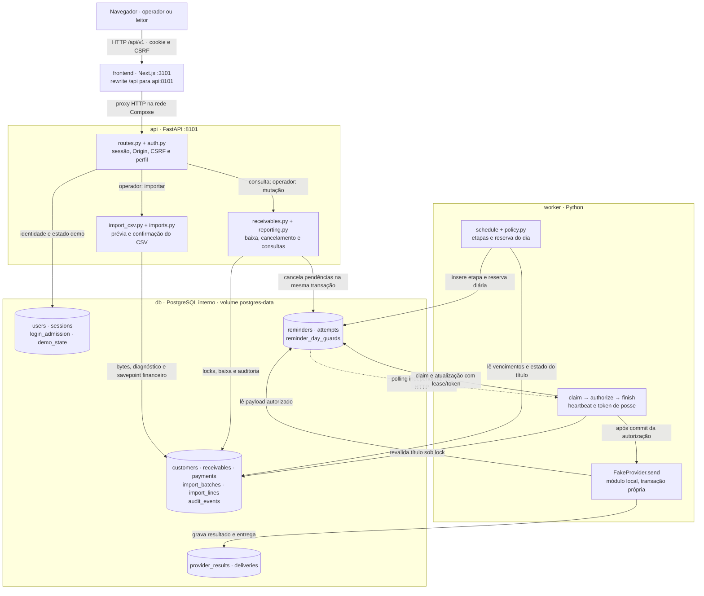
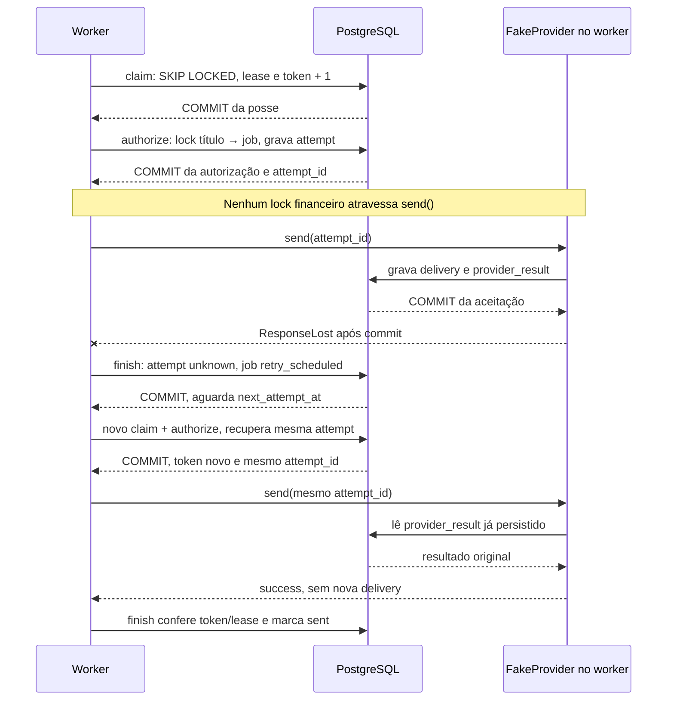

# Arquitetura da gestão de recebíveis

## Problema, usuários e limites

Importação de títulos, recebimentos e lembretes simulados. Operadores importam, pagam, cancelam e controlam a demo; leitores consultam. Uma empresa, BRL, pagamento integral.

**Problema central:** preservar a identidade e o valor de uma dívida quando o arquivo, a requisição de pagamento ou uma tentativa de envio se repetem. A arquitetura coordena essas decisões no banco e deixa a interface mostrar o que foi confirmado. O público pretendido é quem confere uma carteira de recebíveis; a demonstração não comprova adoção por uma empresa real.

## Componentes

São quatro processos permanentes no [Compose](../compose.yaml): `frontend`, `api`, `worker` e `db`. As caixas abaixo abrem os módulos Python e os grupos de tabelas; não representam microserviços ou bancos separados. API e worker usam SQLAlchemy síncrono/psycopg e compartilham `gestao_recebiveis`.

Setas contínuas são chamadas ou acessos síncronos dentro de cada fluxo. A pontilhada marca a retirada de trabalho durável em segundo plano: o worker consulta o banco, não recebe mensagens da API. `FakeProvider` também lê o payload de `attempts`; seu ledger fica no mesmo banco para permitir reproduzir resposta perdida e reinício.

| Módulo / processo | Entrada → responsabilidade → saída | Fronteira |
| --- | --- | --- |
| [Cliente HTTP](../frontend/src/lib/api.ts) e [proxy](../frontend/next.config.ts) | Formulários e filtros → `/api/v1` com sessão/CSRF → estados de tela | A interface apresenta o resultado confirmado; não decide saldos |
| [Autenticação](../backend/src/gestao_recebiveis/auth.py) e [admissão de login](../backend/src/gestao_recebiveis/login_admission.py) | Cookie ou credenciais → usuário/perfil → acesso ou 401/403 | Login reserva cota em transação independente; falha de senha não desfaz a reserva |
| [Importação](../backend/src/gestao_recebiveis/imports.py) | CSV persistido → validação, comparação e confirmação → lote com relatório | Savepoint isola alterações financeiras do diagnóstico de rejeição |
| [Recebíveis](../backend/src/gestao_recebiveis/receivables.py) | Título + chave de pagamento → locks e transição → pagamento integral | Pagamento, estado, pendências e auditoria compartilham commit |
| [Worker](../backend/src/gestao_recebiveis/worker.py) e [fila](../backend/src/gestao_recebiveis/reminders/service.py) | Vencimento/job → agendamento, posse e autorização → tentativa finalizada ou reagendada | Claim, autorização e finalização têm transações curtas separadas |
| [Simulador](../backend/src/gestao_recebiveis/reminders/provider.py) | `attempt_id` → resultado imutável e entrega por chave → sucesso/falha/resposta perdida | Executa após o commit da autorização; não é integração de envio externo |

A API e o frontend são publicados em `127.0.0.1:8101/3101`; o PostgreSQL só tem endereço na rede Compose. O acesso direto à API continua sujeito às mesmas guardas. `db-init` usa o administrador para provisionar papéis; `migrate` usa `gestao_owner`; API, worker e seed usam `gestao_app`. A inicialização segue banco saudável → provisionamento → migração → API/worker; o frontend espera a saúde da API. O seed é uma tarefa do perfil `tools`.

Esses processos rodam no mesmo computador na demonstração. Separar containers e volumes não cria tolerância à perda do host. Se a necessidade fosse apenas somar um CSV sem atualização concorrente nem envio, uma rotina de validação e relatório seria uma alternativa menor. A aplicação acrescenta persistência, permissões e coordenação para exercitar os casos descritos no [guia de problemas](problem-solution.md); não há benchmark que prove superioridade sobre essa alternativa.

## Dados e transações

Cliente único por source_system/external_customer_id; título por source_system/external_receivable_id. IDs internos em INTEGER positivo; valores em BIGINT de centavos. Estado open/paid/canceled persistido; overdue calculado. Pagamento único por título, chave idempotente e conteúdo conferidos. Lotes guardam bytes originais, SHA-256, linhas e relatórios.
Importação: lote bloqueado; savepoint para clientes/títulos/auditoria; erro desfaz todos os efeitos financeiros, preservando diagnóstico. Clientes e títulos são processados em ordem de chave com ON CONFLICT DO NOTHING seguido de comparação bloqueada.
Pagamento/cancelamento: lock título antes de jobs, alteração financeira, cancelamento de pendências e auditoria na mesma transação. Pagamento também serializa a chave idempotente com advisory lock; reutilizar a chave para outro título ou conteúdo resulta em conflito. Os locks decisivos atualizam a instância SQLAlchemy com `populate_existing`, evitando decisões sobre um objeto cacheado antes de uma mudança concorrente.

Na API, `get_session` abre a transação e a dependência FastAPI usa escopo `function`: o commit termina antes de enviar a resposta ao cliente. Casos de uso não fazem commit. O worker e os comandos de seed abrem suas próprias transações, usando os mesmos casos de uso.

### Relações que sustentam as garantias

| Tabelas em `models.py` | Relação e restrição usada pelo fluxo |
| --- | --- |
| `customers` → `receivables` | Um cliente tem vários títulos; cada identidade externa é única dentro de `source_system` |
| `import_batches` → `import_lines` | Lote mantém conteúdo binário e SHA-256; linhas são únicas por lote/número e conservam a conferência |
| `receivables` → `payments` | Até um pagamento por título; `idempotency_key` é única e `request_hash` compara título/nota |
| `receivables` → `reminders` → `attempts` | Job único por título/etapa e título/dia; tentativa única por job/número, com payload da autorização |
| `reminder_day_guards` | Reserva única por título/data comercial; limita recuperação de etapas no mesmo dia |
| `attempts` → `provider_results`; `reminders` → `deliveries` | Resultado único por tentativa; entrega única por lembrete e chave idempotente |
| `audit_events` | Liga eventos ao título/ator quando aplicável; `dedupe_key` evita repetir o mesmo evento de fila |

As restrições estão em [`models.py`](../backend/src/gestao_recebiveis/models.py). O arquivo CSV fica em `import_batches.content`, dentro do PostgreSQL; não há volume de arquivos de upload separado.

### Duas requisições que alteram a carteira

1. **Importação:** `POST /api/v1/imports` valida o CSV e persiste uma prévia, sem inserir títulos. `POST /api/v1/imports/{id}/confirm` bloqueia o lote, relê seus bytes e revalida contra a carteira atual. Inserções e auditoria financeira ficam num savepoint; qualquer conflito desfaz esse trecho e mantém `status=rejected`, linhas e relatório na transação externa. Uma confirmação repetida retorna o lote já encerrado.
2. **Baixa:** `POST /api/v1/receivables/{id}/payments` recebe chave e nota. O advisory lock serializa a chave antes de verificar um pagamento anterior. A mesma chave/conteúdo devolve o pagamento existente; conteúdo diferente conflita. Para um pagamento novo, o lock do título antecede os jobs; `paid`, pagamento, cancelamento de pendências e evento de auditoria são confirmados juntos.

Esses limites são exercitados em [`test_financial.py`](../backend/tests/test_financial.py): prévia revalidada, conflito atômico, imports concorrentes e uma chave de pagamento disputada por dois títulos.

## Contratos HTTP

Rotas sob `/api/v1` recebem entradas Pydantic e declaram modelos de resposta em `responses.py`. Centavos atravessam JSON como strings de inteiros não negativos; timestamps exigem fuso, estados são explícitos e listas seguem paginação tipada. Serializadores selecionam os campos públicos; senhas e conteúdo bruto dos lotes não fazem parte das respostas. O [contrato HTTP](api-contract.md) resume os recursos e o Swagger local expõe o OpenAPI.

O upload aceita CSV UTF-8 até 2 MiB e 5.000 registros. Um middleware limita o corpo antes do parser, inclusive sem `Content-Length`: upload com 64 KiB adicionais de envelope, demais mutações com 8 KiB. A confirmação sempre relê o conteúdo persistido e revalida o estado do banco. A lista de lotes projeta apenas o resumo necessário à tabela; relatórios completos pertencem ao endpoint de detalhe.

## Organização e interface

`import_csv.py` valida bytes, campos, dinheiro e calendário sem banco. `imports.py` compara com a carteira e confirma a importação. Os erros são agrupados por linha para montar a prévia sem varreduras repetidas.

A página inicial controla a sessão. `features/login.tsx` cuida da entrada; `features/workspace.tsx` coordena as áreas; `components/workspace-navigation.tsx` cuida de navegação e foco. A lista de títulos e seu detalhe possuem componentes distintos. `import-preview.tsx` pagina a conferência em 50 linhas, enquanto `imports.tsx` conduz upload, confirmação e histórico. A resposta de detalhe ainda transfere o relatório completo limitado a 5.000 registros.

No celular, Menu abre cinco destinos verticais em diálogo nativo com Escape, contenção de foco e retorno ao botão de origem; o Workspace coordena o foco no conteúdo após mudanças de área ou detalhe, inclusive pelos atalhos financeiros e pelo botão de retorno. A conta tem diálogo próprio. No Resumo, os filtros antecedem a posição financeira; o formulário mantém rascunho separado do último recorte aplicado. Datas invertidas permanecem abertas, com erro associado aos campos e sem nova consulta. Aberto decompõe-se em vencido e em dia (inclui hoje), com ações que preservam busca e vencimento ao abrir os títulos. Recebido mantém seu intervalo independente e explícito.

## Fila e falhas

Política D-3/D0/D+3/D+7 às 09:00 de São Paulo. Etapas antigas viram eventos idempotentes. Unicidade de título/etapa e título/dia; reserva diária também impede rajada na recuperação.
Claim curto via SKIP LOCKED; autorização separada bloqueia título -> job. Lease 60s, renovação 20s, token crescente impede atualização de worker antigo. Provedor fora da transação da autorização. Tentativa autorizada é durável; resultado desconhecido exige reconciliação da mesma tentativa/chave antes de permitir etapa posterior.
O laço agenda uma vez por segundo por padrão (`WORKER_POLL_SECONDS`, relógio monotônico). Enquanto isso, consome os jobs disponíveis sem executar uma varredura completa da carteira por entrega. A pausa de demonstração mantém o agendador ativo; o processamento só retoma pelo controle de operador.

Cada varredura bloqueia primeiro os títulos e carrega seus jobs em lote; tentativas recentes são buscadas juntas quando há execução a reconciliar. Uma etapa já existente não regrava eventos de etapas antigas. O teste com a carteira inicial já agendada exige no máximo quatro consultas SELECT e nenhuma escrita numa nova varredura ociosa. A ordem de locks, reservas diárias e recuperação por lease permanecem as mesmas.

Fake guarda resultado imutável por tentativa e entrega única por chave. Resposta perdida ocorre depois do commit da entrega. O padrão é cinco tentativas; retries 30/120/600/1800s, ou 1/2/4/8s no demo. `MAX_ATTEMPTS` e `DEMO_RETRY_BASE_SECONDS` permitem ajustar limite e escala no ambiente. Reconciliação não consome tentativa nova.
Baixa confirmada impede novas autorizações. Autorização anterior pode produzir efeito e fica rastreável; não há promessa geral de entrega única em provedores externos.

### Resposta perdida depois da aceitação

Se o processo cair antes de `finish`, o job permanece `processing` até o lease expirar; outro claim pode continuar a mesma tentativa. O heartbeat renova a posse durante `send`, mas a finalização sempre revalida token e prazo. Um worker atrasado não pode sobrescrever o resultado de um sucessor.

A baixa pode ocorrer entre autorização e entrega. Ela bloqueia novas autorizações, mas conserva a tentativa já autorizada para reconciliação; por isso o diagrama não promete que uma baixa desfaz uma entrega em trânsito. A sequência e essa corrida têm casos em [`test_reminders.py`](../backend/tests/test_reminders.py), incluindo `test_lost_response_replays_same_attempt_after_provider_restart` e `test_payment_authorization_race_has_explicit_lock_order`.

## Relógios, segurança e operação

Relógio comercial demo: 2026-08-17T10:00:00-03:00; governa vencimento, política e `paid_at`. Relógio de infraestrutura real UTC governa sessões, auditoria de gravação, leases e retries. O demo aceita avanço somente para frente, com fuso obrigatório e anos de 1900 a 2199. A política calcula diferença entre datas para evitar overflow nos extremos de vencimento aceitos pelo contrato.

Sessão opaca persistida, cookie cf_session HttpOnly/SameSite=Lax; Argon2, permissões no backend, CSRF e origem exata. Contas marcadas `is_demo` são criadas e aceitas somente em modo demo; desativá-lo também bloqueia sessões existentes dessas contas. Modo HTTP é local; HTTPS exige Secure.
Compose pf-gestao-recebiveis, portas 127.0.0.1:3101/8101, banco interno e volumes isolados. Qualquer diretório de clone é válido; dependências, banco e caches executam em Docker. PostgreSQL está fixado em 18.6 sobre Alpine 3.24, com digest da imagem base. `database/Dockerfile` usa `su-exec` na troca de usuário feita pelo entrypoint; dispensa o binário Go `gosu` original. Python e Node também usam bases Alpine fixadas por digest. Pool por processo com até 10 conexões, espera de 5 s, conexão de 5 s, lock de 5 s e statement de 15 s. Esgotamento do pool retorna 503 recuperável. A API descarta seu pool ao encerrar.

## Riscos e verificação

Corridas usam PostgreSQL real, conexões independentes e sincronização controlada. A suíte cobre importação concorrente, pagamento versus autorização, posse expirada, repetição de tentativa antiga e resposta perdida. Fixture manual confere totais; pytest/HTTPX verificam regras e contratos; Playwright percorre a jornada.

Backend usa `db-test` em `tmpfs`. E2E usa o projeto `pf-gestao-recebiveis-e2e`, também com PostgreSQL temporário e sem portas no host, definido pelo override `compose.e2e.yaml`. O navegador compartilha a rede do frontend temporário e acessa `http://localhost:3101`, preservando a mesma origem protegida pela API. Esses testes não reutilizam o banco da demonstração.

`scripts/prove.ps1` usa `compose.proof.yaml`, projeto `pf-gestao-recebiveis-proof`, banco `gestao_recebiveis_proof_test` e volume próprios, sem portas no host. `persistence_probe.py` exige alvo e modo exatos: grava uma aceitação, encerra abruptamente com código 86 antes de finalizar, e outro processo reconcilia após restart real desse PostgreSQL. O lease de três segundos usa tempo real; o token antigo é recusado. O script verifica prontidão, executa a jornada pelo proxy/Chromium e remove somente os recursos descartáveis. [Como rodar a verificação](verification.md).

Referências: [SELECT e locks](https://www.postgresql.org/docs/current/sql-select.html), [unicidade](https://www.postgresql.org/docs/current/indexes-unique.html), [testes FastAPI](https://fastapi.tiangolo.com/tutorial/testing/) e [proxy Next.js](https://nextjs.org/docs/app/api-reference/config/next-config-js/rewrites).

## Identidades do PostgreSQL e admissão de login

O serviço descartável `db-init` usa o administrador somente para provisionar `gestao_owner` e `gestao_app`. As migrações usam o primeiro; API, worker e seed usam o segundo, com DML e uso de sequências, sem DDL ou criação de papéis. A tabela `alembic_version` permite somente leitura ao runtime.

`login_admission` armazena contadores efêmeros identificados por HMAC. Reservas usam uma transação independente da autenticação e um advisory lock por origem; a falha de credenciais não desfaz a reserva. Uma autenticação bem-sucedida libera somente a própria reserva. O relógio da demonstração não interfere na expiração. Veja [segurança](security.md) para cotas, limitações de proxy e migração de instalações existentes.

## Fronteira de recuperação

A [prova de restauração](restore-proof.md) separa origem e destino em projetos e volumes próprios. Antes de retomar operações, compara o conteúdo das tabelas e sequências e verifica as permissões do runtime; depois confere idempotência e reconciliação. O banco contém também o ledger do provedor fictício. Por isso, recuperar esse conjunto não prova a recuperação de um efeito em serviço externo. O [plano de integração](provider-integration-plan.md) trata essa fronteira e a necessidade de cópia fora do host.

## Código e evidências relacionados

| Tema                                          | Implementação e critérios                                                                                                                                                                                         |
| --------------------------------------------- | ----------------------------------------------------------------------------------------------------------------------------------------------------------------------------------------------------------------- |
| Problema, usuários e limites                  | [`auth.py`](../backend/src/gestao_recebiveis/auth.py) · [`schemas.py`](../backend/src/gestao_recebiveis/schemas.py)                                                                                               |
| Componentes                                   | [`worker.py`](../backend/src/gestao_recebiveis/worker.py) · [`database.py`](../backend/src/gestao_recebiveis/database.py) · [`provider.py`](../backend/src/gestao_recebiveis/reminders/provider.py)               |
| Dados e transações                            | [`models.py`](../backend/src/gestao_recebiveis/models.py) · [`imports.py`](../backend/src/gestao_recebiveis/imports.py) · [`receivables.py`](../backend/src/gestao_recebiveis/receivables.py)                     |
| Contratos HTTP                                | [`responses.py`](../backend/src/gestao_recebiveis/responses.py) · [`request_limits.py`](../backend/src/gestao_recebiveis/request_limits.py) · [`import_csv.py`](../backend/src/gestao_recebiveis/import_csv.py)   |
| Fila e falhas                                 | [`reminders/service.py`](../backend/src/gestao_recebiveis/reminders/service.py) · [`policy.py`](../backend/src/gestao_recebiveis/reminders/policy.py) · [`config.py`](../backend/src/gestao_recebiveis/config.py) |
| Relógios, segurança e operação                | [`clock.py`](../backend/src/gestao_recebiveis/clock.py)                                                                                                                                                           |
| Riscos e verificação                          | [`test_financial.py`](../backend/src/gestao_recebiveis/../../tests/test_financial.py) · [`test_reminders.py`](../backend/src/gestao_recebiveis/../../tests/test_reminders.py)                                     |
| Identidades do PostgreSQL e admissão de login | [`provision_database.py`](../backend/src/gestao_recebiveis/provision_database.py) · [`login_admission.py`](../backend/src/gestao_recebiveis/login_admission.py)                                                   |
