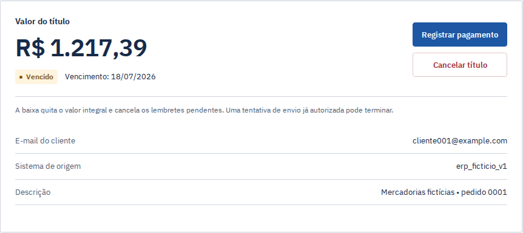

# Demo de cinco minutos

A duração sugerida é uma estimativa, não uma medição com usuários.

Pré-condição: execute `./scripts/gestao-recebiveis.ps1 setup` e entre em http://localhost:3101 como `operador@example.com`, senha `Recebiveis!2026`. Carteira inicial: 240 títulos e 48 pagamentos fictícios; data comercial 17/08/2026 às 10:00. O processamento inicia pausado; o agendador permanece ativo. Se esta carteira já foi alterada em apresentações anteriores, use o reset explícito descrito abaixo antes de começar. O tempo abaixo é aproximado e pressupõe as imagens já construídas.

O reset remove os dados da demonstração local e recria a carteira inicial. Exige modo demo, confirmação e credenciais de operador; execute somente quando quiser reiniciar essa carteira:

```powershell
$DemoCredential = Get-Credential -UserName 'operador@example.com'
.\scripts\gestao-recebiveis.ps1 reset -ConfirmReset -Credential $DemoCredential
```

1. **Resumo (30s).** Mostre a identificação da demonstração e a data comercial. No candidato atual, o saldo aberto agrupa vencido e em dia; recebido aparece separado com seu período. Nenhum desses valores depende de abrir disclosure. O [CI do commit `5718cdad`](https://github.com/arthurjoanes/gestao-recebiveis/actions/runs/35744528178) executou essa composição e aprovou 15 casos (14 jornadas interativas e um de formatação); use as capturas históricas somente com a versão indicada. O CI não mede a duração de cinco minutos deste roteiro. Explique que aberto/vencido filtram vencimento, enquanto recebido filtra data de pagamento. Use **Ver títulos vencidos** para conferir o recorte. Os filtros ficam acima da posição financeira; **Hoje**, **Este mês**, **Personalizado** e **Limpar filtros** controlam o período. Inverta um intervalo para mostrar o erro junto ao campo, preservando o resultado anterior. No celular, use **Menu** para acessar todas as áreas. Toda informação financeira vem do banco.
2. **Importar (45s).** Em Importações, envie `data/samples/valid.csv`. A prévia deve indicar três títulos novos e **R$ 2.000,00**. Confirme e procure `DEMO-001` em Títulos. A carteira passa a ter 243 títulos.
3. **Repetir (30s).** Importe `data/samples/repeated.csv` ou `reordered.csv`. Os três títulos aparecem como existentes; confirme. A quantidade e o total financeiro não aumentam. O lote registra o que aconteceu.
4. **Falha transitória e retry (60s).** Abra **Demonstração**. Em **Buscar título em aberto**, procure `DEMO-001`; selecione o título, escolha **Falha transitória seguida de sucesso** e clique **Aplicar cenário** antes da primeira tentativa. Clique **Retomar processamento**. Em Lembretes, localize o título: a primeira tentativa falha, o retry usa a mesma intenção/chave e chega a enviado. No modo demo padrão, os intervalos são 1/2/4/8 segundos. Clique em **Ver tentativas** para abrir o detalhe ao lado da fila no desktop, ou acima dela em telas estreitas. Confira as duas tentativas e a entrega simulada; **Fechar detalhe** devolve o foco à ocorrência selecionada, preservando os filtros e a página. Volte a Demonstração e clique **Pausar processamento**. O agendador continua ativo; autorizações anteriores à pausa podem concluir.
5. **Pagamento e pendências (60s).** Com o processamento pausado, use **Nova data e hora comercial**, em Demonstração, para avançar para 20/08/2026 às 10:00. Aguarde aparecer a nova intenção D0 de `DEMO-003` em Lembretes. Abra esse título, registre pagamento integral e confira a baixa, o evento financeiro e a intenção pendente cancelada. Retome o processamento para mostrar que nenhuma nova autorização ocorre após a baixa.
6. **Conflito sem alteração parcial (40s).** Anote os indicadores atuais. Importe `data/samples/conflicting.csv`: mudança de R$ 1.250,09 para R$ 9.999,99 no `DEMO-001` deve bloquear o lote. `DEMO-004` não pode aparecer na carteira e os indicadores permanecem iguais. Mesmo que `DEMO-001` já esteja pago, a repetição não sobrescreve o estado.
7. **Testes (30s).** Abra `backend/tests/` e `docs/verification.md`: importações concorrentes, dois workers, token antigo, resposta perdida e pagamento versus autorização.



_Captura real de 22/09/2026, sem efetuar baixa ou cancelamento. [Outras telas atuais e reprodução](image-captures.md). A imagem anterior em `img/titulo.png` permanece somente como evidência histórica._

## Cenários adicionais

Na área Demonstração, escolha falha permanente ou resposta perdida em um título aberto ainda sem tentativa. A falha permanente encerra sem retry; a resposta perdida persiste aceitação no provedor e reconcilia a mesma tentativa, sem segunda entrega. O cenário de falha transitória contínua esgota cinco tentativas na configuração padrão.

O avanço de data usa o relógio comercial; sessões, leases e atrasos usam o relógio real. As etapas são D−3, D0, D+3 e D+7 às 09:00; somente a mais recente elegível será criada. Etapas passadas ficam no histórico, sem rajada de mensagens atrasadas.

## Teste de reinício isolado em 5–8 minutos

Com as imagens de setup/test já disponíveis, execute na raiz:

```powershell
.\scripts\gestao-recebiveis.ps1 proof
```

O comando constrói backend, frontend e navegador pelo código atual, aplica migrações em banco vazio e executa os testes. O teste tem um projeto próprio (`pf-gestao-recebiveis-proof`), sem portas no host, e descarta somente o volume desse projeto. A carteira de apresentação não é resetada nem seu banco reiniciado.

1. **Problema (1 min).** Uma resposta perdida não informa se a mensagem foi aceita. Repetir como novo trabalho pode duplicar o efeito; assumir falha pode ocultar uma entrega. Explique por que o nome/hash do CSV também não resolve duplicação de títulos.
2. **Valor esperado (1 min).** Abra `accepted-before-interruption.json`: um título de 31 centavos, uma tentativa autorizada ainda `unknown`, uma entrega persistida. O processo sai com código 86 no ponto de falha, sem chamar `finish`.
3. **Falha e recuperação (1 min).** O script reinicia somente o PostgreSQL descartável. Abra `recovered-after-restart.json`: horário de início do banco mudou, o token aumentou e o proprietário antigo foi recusado. A mesma tentativa passa a `success`, com uma entrega. O lease usa tempo real, sem avanço artificial.
4. **Jornada (2 min).** `proxy-journey.txt` registra importação de três títulos/200000 centavos, repetição sem aumento, retry transitório, baixa idempotente e conflito sem alteração parcial. O HTTP atravessa Next → API; os casos Chromium percorrem a interface e estados de erro/acesso.
5. **Decisão e limite (1 min).** Localize `claim`, `authorize`, `finish` e `FakeProvider.send`. Há transação antes e depois da chamada, não um lock mantido durante o provedor. A baixa bloqueia autorizações futuras; não desfaz a anterior. O fake persistente permite esse teste local, mas não garante entrega a um cliente nem exactly-once externo.

O diretório `artifacts/proof/<execução>/` guarda relatório, hashes e resultados. Código inesperado interrompe a execução; o cleanup ocorre mesmo em falha. Logs e arquivos de uma execução com falha permanecem para diagnóstico. Capturas Chromium ficam em `artifacts/proof-e2e/`.

O cenário interrompe o processo do teste no mesmo limite transacional usado pelo worker e reinicia o PostgreSQL. Não cobre perda de disco, desastre do host, carga de produção ou contrato de um provedor externo.

## Percurso documentado de restauração

Para apresentar recuperação sem alterar a carteira do setup, use a [história com quatro capturas](restore-proof.md): lote de R$ 125 confirmado, arquivo conflitante de R$ 150 rejeitado, mesma tentativa reconciliada e baixa de R$ 50 preservada. O valor rejeitado é o total do arquivo candidato; a carteira permaneceu em R$ 125. A fixture, os hashes e o comando de reprodução estão nessa página. É uma prova separada de restauração em outro volume, com provedor fictício e dados sintéticos; não representa teste com operadores reais.

## Executar sem PowerShell

Copie `.env.example` para `.env` e substitua `SESSION_SECRET`, `DATABASE_PASSWORD`, `DATABASE_OWNER_PASSWORD` e `DATABASE_APP_PASSWORD` por valores aleatórios independentes. Execute na raiz do clone:

```sh
docker compose build db
docker compose build api
docker compose build frontend
docker compose up -d --wait db
docker compose run --rm migrate
docker compose run --rm --no-deps seed
docker compose up -d --wait --wait-timeout 180 db api worker frontend
```

A tarefa `migrate` depende de `db-init`, que provisiona os papéis. Fontes: [Compose](../compose.yaml) e [setup PowerShell](../scripts/gestao-recebiveis.ps1). Uma instalação legada deve seguir a [migração documentada](verification.md#banco-de-versões-anteriores) antes destes passos.

## Código e evidências relacionados

[seed](../backend/src/gestao_recebiveis/seed.py) · [amostra CSV](../data/samples/valid.csv) · [política](../backend/src/gestao_recebiveis/reminders/policy.py).
