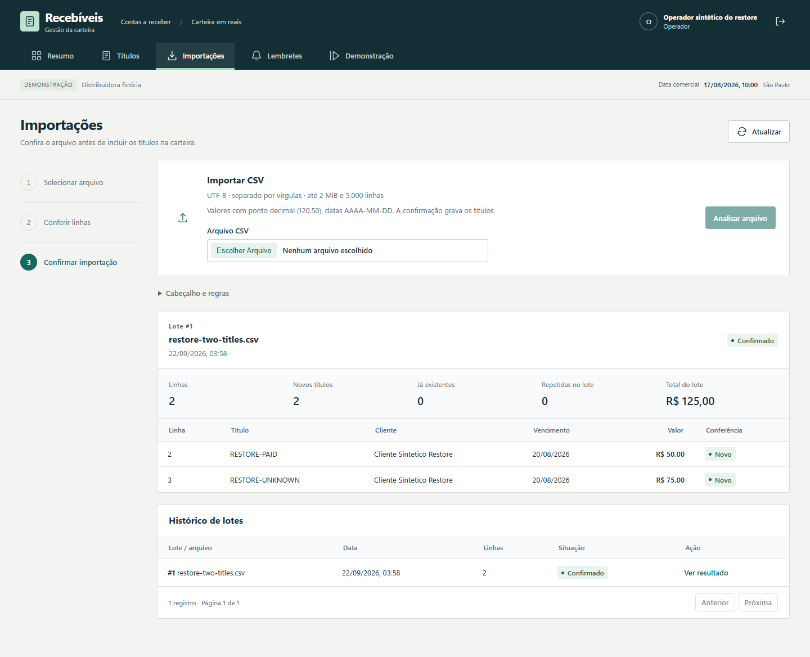
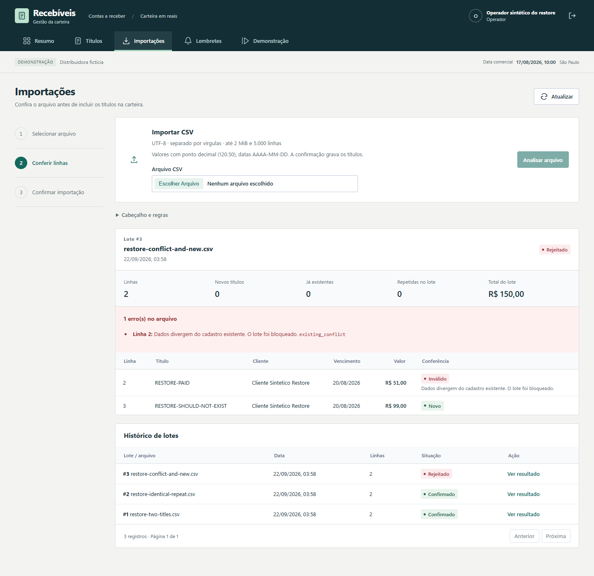
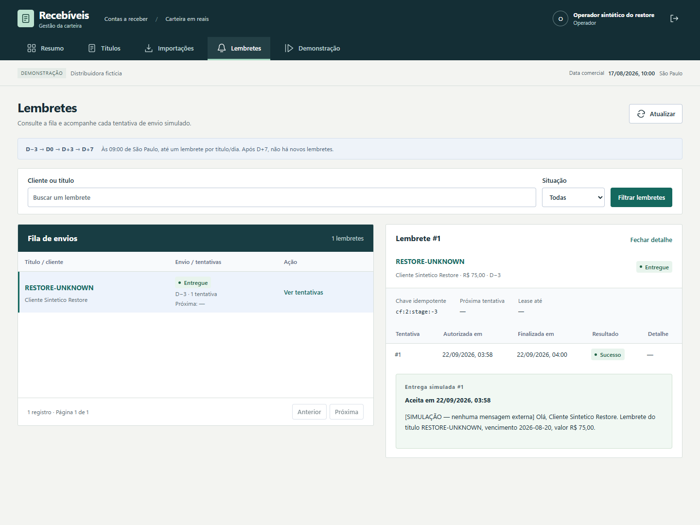
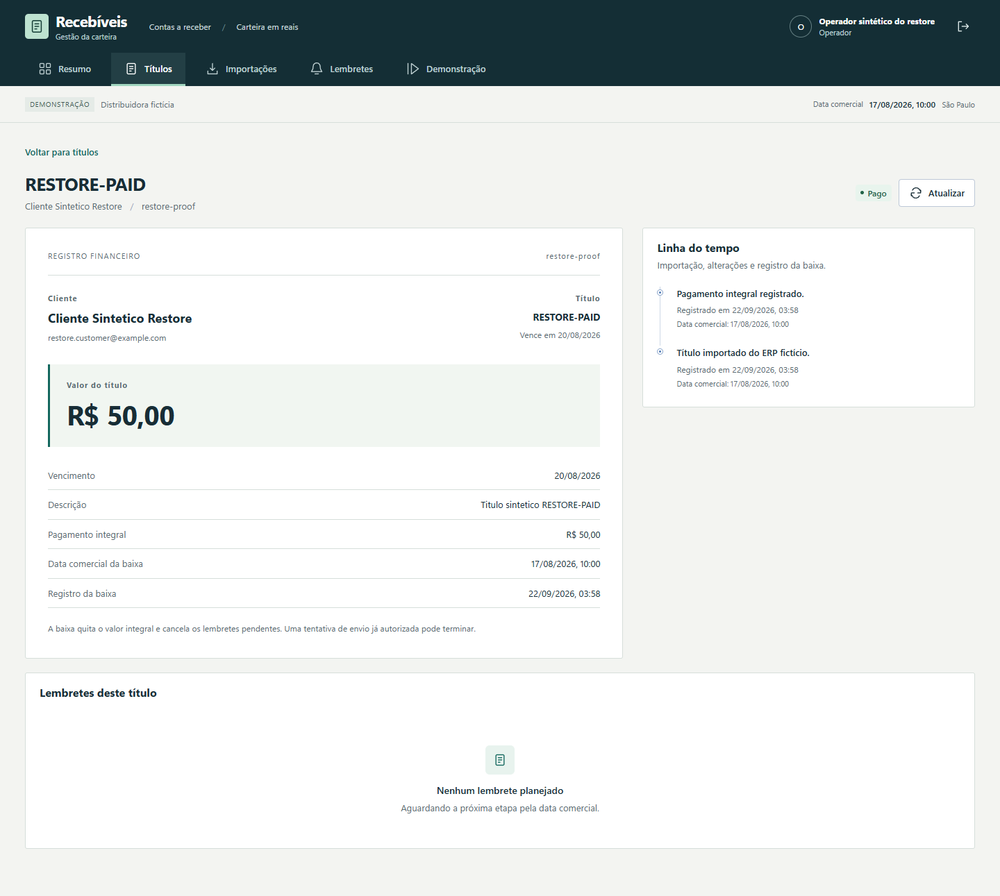

# Recuperar a carteira sem repetir seus efeitos

Restaurar um banco não basta para retomar cobranças: é preciso preservar a baixa já registrada e descobrir se uma tentativa pendente já foi aceita. Esta prova restaura uma carteira sintética em outro volume e confere esses fatos antes de continuar. O caso representa um risco técnico do domínio; não é um incidente de cliente.

Em 22/09/2026, a execução `11adf9df35ba4314945ffdd4fbaeabfc` passou: **R$ 125 em títulos, R$ 50 pagos e R$ 75 abertos**, sem uma segunda baixa nem outra entrega simulada. O [índice](evidence/restore-proof/index.json) preserva também duas tentativas de preparação que falharam. O [manifesto da execução](evidence/restore-proof/11adf9df35ba4314945ffdd4fbaeabfc/manifest.json) contém imagens, fontes, fases, resultados, hashes e limpeza.

## O que foi conferido

| Etapa | Resultado observado | Por que importa |
| --- | --- | --- |
| Importação | Dois títulos, de R$ 50 e R$ 75, totalizam R$ 125 | Estabelece um resultado financeiro pequeno e conferível |
| Repetição idêntica | Dois títulos existentes, nenhum novo; registros financeiros iguais | Reenviar o CSV não aumenta a dívida |
| Conflito | O arquivo candidato soma R$ 150; lote rejeitado, carteira ainda R$ 125 e título novo ausente | Um conflito não deixa importação parcial |
| Corte do backup | Pagamento #1 de R$ 50; tentativa #1 com resultado desconhecido; entrega simulada #1 já aceita | Reproduz uma resposta perdida após aceitação |
| Restauração em destino vazio | Conteúdo das 16 tabelas públicas, incluindo a versão do schema, e estado das 12 sequências iguais ao corte | Confere os registros, não apenas contagens ou a abertura da aplicação |
| Repetição da baixa restaurada | Mesmo pagamento #1 e estado completo igual; observação diferente recusada como conflito de idempotência | Uma resposta perdida não autoriza outra baixa |
| Reconciliação | Mesma tentativa #1 concluída, mesmo lembrete e mesma entrega #1; token de posse passou de 1 para 2 | O processo antigo perdeu autoridade para concluir; não foi criada outra tentativa |
| Final | Origem e dump original preservados; zero containers, volumes ou redes dos dois projetos descartáveis | A prova não substitui nem remove a carteira de demonstração |

A reconciliação acrescentou dois eventos de auditoria e alterou o estado do lembrete/tentativa. Algumas sequências avançaram sem nova linha por `INSERT ON CONFLICT`; isso foi registrado. A igualdade integral é exigida **antes** da reconciliação, não depois de mudanças legítimas do negócio. O login da captura no destino ocorreu após essas comparações.

## Capturas da mesma execução

As páginas foram renderizadas pelo frontend real em Microsoft Edge/Chromium 153.0.4234.48, com viewport de 1440 × 1080 e captura de página inteira. Os dados são sintéticos; a data comercial da demonstração difere do horário real do ensaio. O probe preparou o cenário pelas funções de domínio; o navegador efetuou login e leitura. Estas imagens não representam uma jornada que digita e confirma todas as operações na interface.



*Lote #1: duas obrigações financeiras identificadas, sem depender do nome do arquivo para impedir repetição.*



*Os R$ 150 pertencem ao arquivo candidato rejeitado. O banco e a consulta HTTP confirmaram que a carteira permaneceu em R$ 125. “Novo” nessa linha descreve a análise do arquivo; o título não foi inserido.*



*No destino restaurado, tentativa #1 concluída e entrega simulada #1 preservada. Nenhuma mensagem externa foi enviada.*



*A baixa de R$ 50 continuou associada ao título original. A verificação do banco, além da imagem, confirmou o mesmo pagamento #1.*

## Como a prova é isolada

O [executor](../scripts/prove_restore.py) congela as fontes, constrói três imagens sequencialmente e cria projetos distintos de origem e destino, com identificador aleatório. O [Compose exclusivo](../compose.restore-proof.yaml) mantém banco e API em rede interna; só o frontend usa uma ponte adicional e porta em `127.0.0.1` para as capturas. Nenhum worker autônomo é iniciado: o [probe](../backend/tests/restore_probe.py) chama as operações reais de autorização, posse, pagamento e reconciliação em etapas controladas.

O contrato confere modo, identificador, papel, projeto, usuário e nome exato do banco de teste antes de importar o engine da aplicação. A limpeza exige os identificadores de propriedade de cada recurso. Na origem, API e frontend param antes do corte. O dump binário `PGDMP` é copiado como arquivo, sem atravessar um pipeline de texto. O destino precisa estar vazio; a restauração usa transação única e recompõe os papéis restritos antes da conferência. Não executa seed no banco restaurado.

O runtime `gestao_app` foi verificado nos dois bancos: sem flags administrativas, com propriedade e grants esperados, e com recusas reais de criação de tabela, `SET ROLE` para owner e alteração de `alembic_version`.

Dump, credenciais e snapshots completos ficam fora do repositório e do OneDrive, em `%LOCALAPPDATA%/gestao-recebiveis-restore/<run_id>`. No Windows, a DACL foi aplicada e relida antes dos segredos, permitindo usuário atual e SYSTEM. O repositório contém somente resultados selecionados e hashes. Isso é controle de acesso local; não é criptografia nem autenticação do backup.

## Controles de recusa

- Cópia corrompida: recusada antes de criar o destino, mantendo o dump original intacto.
- Destino ocupado: saída 2 antes de copiar/restaurar; snapshot posterior igual ao anterior.
- Modo incorreto: saída 2 antes de importar o engine.
- Token de posse antigo: recusado após a nova posse da mesma tentativa.

O [suplemento CLI](evidence/restore-proof/11adf9df35ba4314945ffdd4fbaeabfc/cli-supplement.json) adicionou uma conferência independente do comando [verify_restore_backup.py](../scripts/verify_restore_backup.py): backup válido retornou 0 e cópia corrompida retornou 2, sem acessar banco ou criar recursos. Esse suplemento ocorreu depois da prova financeira; não é outra execução financeira. Os 104 arquivos congelados permaneceram iguais, e apenas a CLI de leitura e seu teste foram acrescentados depois. **16 testes host** passaram, além de Ruff, formatação e sintaxe JavaScript.

## Medidas e reprodução

| Fase medida com relógio monotônico | Tempo observado |
| --- | ---: |
| Dump, cópia e hash | 1,219 s |
| Preparação do destino | 10,203 s |
| Guarda, cópia e `pg_restore` | 6,735 s |
| Privilégios, igualdade, recusas, repetição e reconciliação | 40,781 s |
| Destino: preparação até reconciliação | 57,719 s |
| Execução completa, incluindo builds com cache, capturas e limpeza | 157,672 s |

Uma observação local, fixture de dois títulos e dump de 48.737 bytes. Os subtotais não devem ser somados ao total que já os inclui. O relógio do host foi `GetTickCount64`, resolução nominal de 15,625 ms; os números não são SLA, estimativa de produção nem teste de capacidade.

Na raiz, com Docker Desktop Linux sem outros containers ativos, PowerShell 7, Python 3.11+, Node e as dependências do frontend instaladas (`npm ci` em `frontend`), além do Microsoft Edge disponível:

```powershell
python scripts/prove_restore.py plan
python scripts/prove_restore.py execute --deadline-seconds 1200
python -m unittest discover -s scripts/tests -p 'test_*restore*.py' -v
```

`plan` descreve os limites sem iniciar serviços. `execute` gera nova fixture e novos projetos, exige o ambiente livre e produz outro manifesto. O orçamento operacional reserva 75 segundos para limpeza; em falha, a limpeza pode dispor de até 60 segundos adicionais a partir de seu início. Não é uma promessa de término exato em 20 minutos. As imagens e os arquivos privados permanecem para investigação; os serviços e volumes descartáveis são removidos.

## Dificuldades observadas e limite da conclusão

A primeira preparação (`45922bc…`) parou na verificação de ACL, antes de iniciar Docker: a chamada ao Windows PowerShell 5 não carregou os cmdlets necessários. O executor passou a usar PowerShell 7 e a conferir a DACL efetiva. A segunda (`4c354c…`) passou por fixture e privilégios, mas a porta do frontend em rede exclusivamente interna não ficou acessível no Docker Desktop. A ponte adicional só para o frontend, a publicação em loopback e a inspeção do binding corrigiram essa preparação. Os manifestos e o diagnóstico continuam no índice; não foram apresentados como provas aprovadas.

Esta entrega acrescenta uma prova de recuperação e guardas no executor; não demonstra uma falha de duplicação financeira corrigida na regra de negócio. Para quem avalia o projeto, permite conferir a ligação entre risco, mecanismo, recusa e estado recuperado.

O provedor fictício guarda aceitação e entrega **no mesmo PostgreSQL restaurado**. Um serviço externo não volta no tempo com o banco: seu contrato precisa ser validado conforme o [plano de integração](provider-integration-plan.md). Também faltam cópia externa, perda do host, restauração de carteira de maior porte e validação com operadores reais. A [prova anterior de interrupção/reinício](verification.md#interrupção-e-recuperação) cobre outro cenário e continua identificada separadamente.
